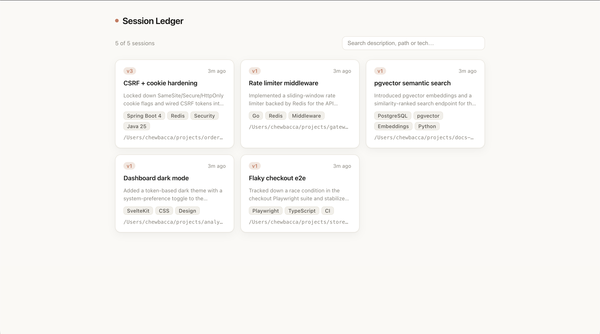
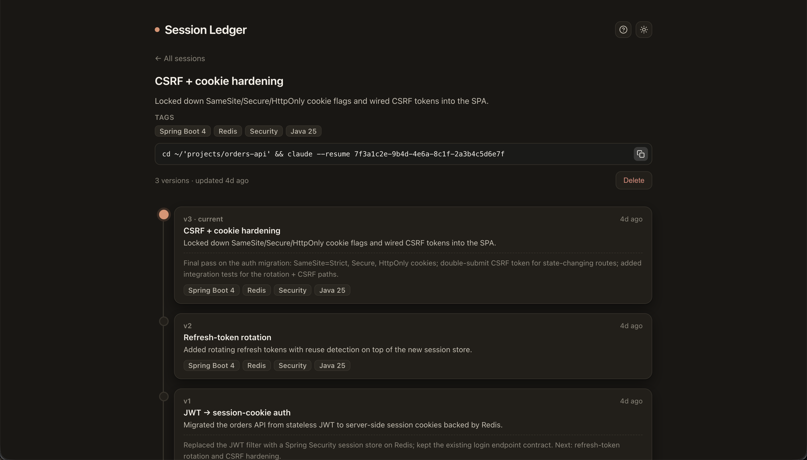

# session-ledger

[](https://github.com/buldiei/claude-code-session-ledger/actions/workflows/ci.yml)


**Claude Code sessions are ephemeral and pile up fast** — which one had that refactor, where did I leave off, how do I jump back in? session-ledger keeps them as browsable, searchable cards you can resume in one click.

Store your Claude Code sessions as **versioned cards**. One self-hosted service, two contracts
with deliberately split CRUD:

| Side | Who | CRUD | Channel |
|------|-----|------|---------|
| Web UI | you | **R + D** (browse, search, delete) | REST `/api/sessions` |
| Claude | the model | **C + U** (save, append a version) | MCP tool over streamable-HTTP `/mcp` |

Each session is a card: `session_id` + a chain of context versions. Re-saving the same session
**appends** a new version (history is preserved) — the UI renders it as a vertical graph with the
latest version on top, plus technology tags, search, and a one-click `claude --resume …` to
continue in the CLI.

It ships as **one container** (Spring serves the API, the MCP endpoint, and the built SvelteKit
SPA from a single origin) plus a **one-command client installer** for Claude Code.

## How it works

1. **Claude saves the session** — run `/save` in any Claude Code session and the model writes a card (title, one-line summary, tags) through the MCP tool. Re-running `/save` appends a new version.
2. **You browse them** — the web UI lists every session as a card, searchable by text and tags, each with its full version-history graph.
3. **Resume in one click** — copy the `claude --resume …` command from a card and pick up exactly where you left off.

## Screenshots

Browse and search your saved sessions:



A session's vertical version-history graph, with technology tags and a copy-paste `claude --resume` command:



## Pick how to run it

| | When | Database | Guide |
|---|------|----------|-------|
| **Standalone** | just want it on your machine, no infra | SQLite (a file) | [docs/run-standalone.md](docs/run-standalone.md) |
| **Server** | host it on another machine, reachable on your network | PostgreSQL | [docs/run-server.md](docs/run-server.md) |

> Setting up with an AI agent? Point it at the repo — [AGENTS.md](AGENTS.md) is the entry point.

The DB is chosen by Spring profile: `sqlite` (Hibernate creates the schema) or `postgres`
(default; Flyway migrations). Switch with `SPRING_PROFILES_ACTIVE`.

## Client integration

However you run the service, wire Claude Code to it with one command:
```bash
client/install.sh <service-url> <mcp-token>
```
It installs, idempotently:
1. the `/save` skill at **user scope** (`~/.claude/skills/save`) — available in every session;
2. the MCP server at **user scope** (`claude mcp add --scope user`; the default *local* scope binds it to one directory).

Restart Claude Code afterwards. Then `/save` summarises the session, picks tech tags, and calls
the `save_session` MCP tool. Run it again later in the same session to append a new version. The
skill gets the live session id from the `${CLAUDE_SESSION_ID}` template variable — no hook needed.

## Configuration (env)

| Variable | Meaning |
|----------|---------|
| `SPRING_PROFILES_ACTIVE` | `postgres` (default) or `sqlite` |
| `SPRING_DATASOURCE_URL/USERNAME/PASSWORD` | Postgres connection (postgres profile) |
| `SESSION_LEDGER_SQLITE_PATH` | SQLite file path (sqlite profile) |
| `SESSION_LEDGER_MCP_TOKEN` | Bearer token required on `/mcp` (blank = open, local only) |
| `SESSION_LEDGER_WEB_BASE_URL` | Optional public URL for card links; derived from the request host when unset |
| `SESSION_LEDGER_CORS_ORIGINS` | Allowed browser origins (only if UI served from a different origin) |
| `SERVER_PORT` | Host port (default 8080) |

`.env` is gitignored. `.env.example` and `db/bootstrap.sql` carry placeholders only — never commit real secrets.

## Local development

JDK 25 (`sdk install java 25-amzn`), Maven, Node 20+.
```bash
mvn spring-boot:run                          # backend (default postgres profile; or set SPRING_PROFILES_ACTIVE=sqlite)
cd frontend && npm install && npm run dev    # Vite dev server on :5173, proxies /api to :8080
```
> macOS: if Tomcat logs `Error setting socket options: Invalid argument`, add
> `-Djava.net.preferIPv4Stack=true` (a JDK/macOS quirk; not needed in the container).

## Tests
```bash
mvn test
```

## Architecture (Clean Architecture, single Maven module)

```
domain/        model (Session, SessionVersion) + ports — no Spring/JPA
application/   use cases: SaveSession (C/U), Query (R), Delete (D)
adapter/in/web   REST controller (R/D) + DTOs
adapter/in/mcp   Spring AI @Tool save_session (C/U only)
adapter/out/persistence   JPA entities + SessionRepository impl
config/        SPA serving, CORS, MCP tool registration, MCP bearer auth
```

## License

MIT — see [LICENSE](LICENSE).

## Caveats
- **Spring AI 2.0.0** (GA 2026-06-12) is recent; MCP transport is `spring.ai.mcp.server.protocol=STREAMABLE`.
- SQLite uses Hibernate's community `SQLiteDialect` with `ddl-auto=update` (no Flyway); intended for a
  single-user local file, not concurrent/production use.
- Web read/delete is unauthenticated — intended for a trusted machine/LAN.
